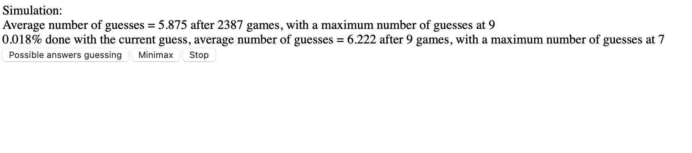
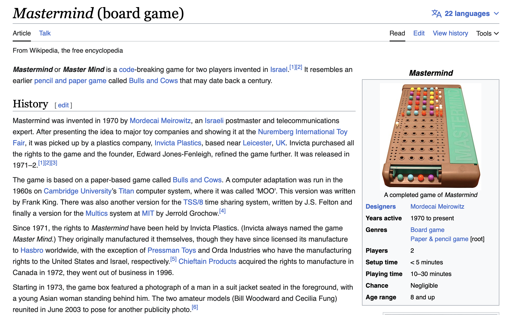

This code implements both a minimax algorithm and a possible-answers restricted algorithm to resolve a dispute with my father about which is more efficient. Probably easy to work out analytically as well. Different from the ruleset on the wikipedia game-theory analysis.

